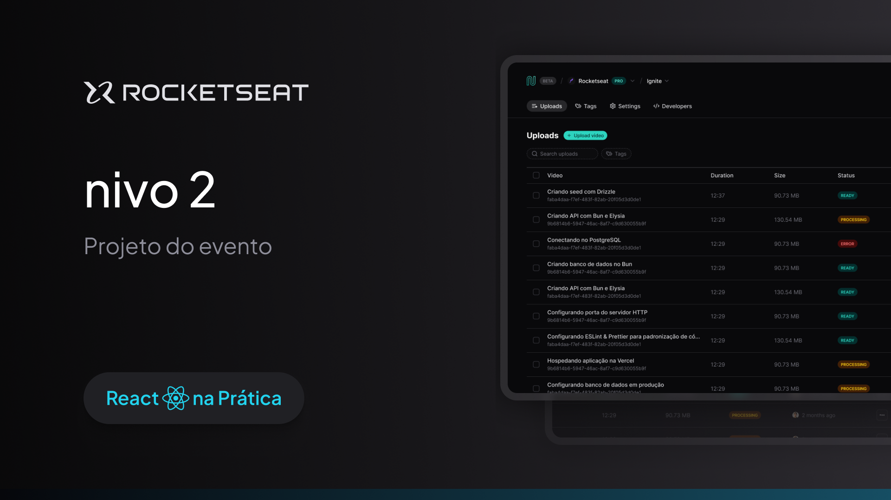

<h1 align="center"> Nivo App </h1>

<p align="center">
Aplicação de listagem de dados desenvolvida no React na Prática da Rocketseat. <br/>
</p>

<p align="center">
  
</p>

<p align="center">
  
</p>

### 🚀 Tecnologias

Esse projeto foi desenvolvido com as seguintes tecnologias:

- React
- React Query
- React Hook Form
- TailwindCSS
- Vite
- shadcn/ui

### 💻 Executando

Após clonar o repositório, acesse a pasta do projeto e execute os comandos abaixo:

```sh
npm install
npm run dev
npm run server
```

Acesse http://localhost:5173 para visualizar a aplicação.

### :memo: Licença

Esse projeto está sob a licença MIT.

---

Feito com ♥ by Isadora Aguiar :wave:
